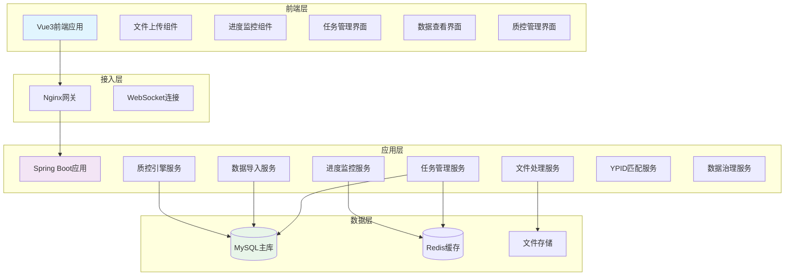
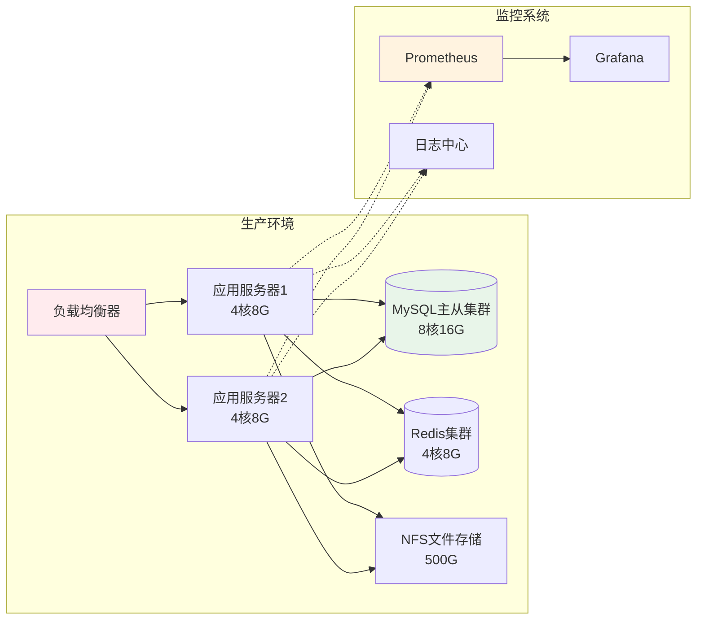

# 药品使用监测质量控制平台系统设计文档V3
## 文档元信息
+ **版本号**: v3.0
+ **创建日期**: 2024-05-29
+ **更新日期**: 2024-12-27
+ **关键词标签**: 药品监测, 质量控制, 数据治理, YPID编码, 医疗数据, 压缩包导入, 独立表存储, 任务管理, 进度监控
+ **快速索引**: 基于芋道框架的药品使用监测数据批量导入、质控、治理一体化平台

## 更新说明
本次V3版本主要更新内容：

1. **引入统一任务管理机制**：所有导入操作通过任务管理，提供完整的生命周期跟踪
2. **实现分层进度监控**：任务级、表级、记录级三层进度监控，精确掌控处理状态
3. **增强状态机设计**：细化任务处理状态，支持精确的阶段控制和异常处理
4. **新增智能重试机制**：支持按失败类型、文件类型、处理阶段的精确重试
5. **优化前端交互体验**：实时进度监控组件，提供直观的处理状态反馈

---

## 1. 需求分析
### 1.1 概述
本章节通过明确的功能定义和边界划分，确保系统设计目标清晰可达，为后续技术实现提供准确的需求基础。药品使用监测质量控制平台旨在解决医疗机构药品使用数据从批量导入到标准化存储的全流程质量保障问题。

### 1.2 系统定位
**药品使用监测质量控制平台解决医疗机构药品使用数据从压缩包批量导入到标准化存储的全流程质量保障问题，通过统一任务管理和独立表存储架构实现高效的数据质控和治理。**

### 1.3 核心功能清单
#### P0 核心功能（必须实现）
+ **统一任务管理**：所有导入操作通过任务进行管理，完整记录处理生命周期
+ **分层进度监控**：提供任务级、表级、记录级的实时进度反馈
+ **压缩包批量导入**：支持包含五张Excel表的压缩包上传与解析
+ **独立表数据存储**：五张业务表分别存储机构信息、药品目录、入库、出库、使用情况数据
+ **前置质控规则验证**：22项前置质控规则，确保数据完整性和格式正确性
+ **后置质控统计分析**：7项后置质控规则，验证业务逻辑一致性
+ **YPID药品编码标准化**：药品编码比对和自动匹配功能
+ **异常数据自动修复**：13种修复策略，支持自动和手动修复
+ **质控报告生成与导出**：分表质控结果汇总和整体质量评估

#### P1 重要功能（优先实现）
+ **智能重试机制**：支持按失败类型、文件类型、处理阶段的精确重试
+ **数据导入进度追踪**：压缩包解压、文件解析、数据入库全过程状态管理
+ **质控规则配置管理**：支持按表类型配置和启用/禁用质控规则
+ **用户权限分级管理**：四级权限体系，支持多角色协作
+ **数据审计日志记录**：完整的操作轨迹和变更历史追踪
+ **按表独立质控**：支持对单张业务表进行独立质控和修复

#### P2 增强功能（后期优化）
+ **数据可视化统计分析**：基于独立表结构的多维度数据分析
+ **批量数据处理任务调度**：支持大批量数据的分批处理和并发优化
+ **系统性能监控面板**：实时监控各表数据处理性能和质量指标
+ **任务优先级管理**：支持重要任务优先处理和资源调配

### 1.4 用户角色定义
> **设计考量**: 基于国家标准WS/T 841-2024中的权限分级要求，结合压缩包导入和独立表管理的需求，优化角色权限体系
>

+ **系统管理员**: 完整系统管理权限，用户管理、规则配置、系统监控、压缩包导入配置
+ **数据管理员**: 数据导入、质控处理、报告生成、异常修复权限、任务管理权限
+ **数据查看员**: 只读权限，查看质控结果、统计报告和各表数据、任务进度
+ **医疗机构用户**: 上传本机构压缩包数据，查看本机构各表质控结果和任务状态

### 1.5 功能边界
#### 系统实现范围
+ 支持标准压缩包格式的五张药品相关表批量导入
+ 提供完整的任务生命周期管理和进度监控
+ 实现国家标准规定的前置和后置质控规则，支持按表类型分别执行
+ 提供基于独立表结构的数据统计和报告功能
+ 支持YPID编码的自动匹配和手动纠正
+ 支持智能化的失败重试和异常恢复

#### 系统不实现内容
+ 复杂的数据挖掘和AI分析功能
+ 与外部药品监管系统的实时对接
+ 分布式集群部署和高可用架构
+ 移动端应用开发

### 1.6 成功指标
+ **功能完整性**: 实现P0功能的100%覆盖，P1功能的80%覆盖
+ **数据准确性**: 质控规则识别准确率>95%，自动修复成功率>80%
+ **系统性能**: 压缩包解压和导入50000条数据在10分钟内完成处理
+ **用户体验**: 关键操作响应时间<3秒，错误提示信息清晰准确，进度反馈实时准确
+ **数据完整性**: 五张表数据关联一致性>99%，无数据丢失
+ **任务成功率**: 任务首次执行成功率>90%，重试后成功率>98%

---

## 2. 架构设计
### 2.1 概述
本章节定义系统的整体技术架构，在满足压缩包批量导入和独立表存储需求的前提下，优先考虑开发效率和维护简便性，同时强化任务管理和进度监控能力。

### 2.2 技术选型及理由
#### 后端技术栈
+ **Spring Boot 3.2**: 成熟稳定，与芋道框架配套，支持压缩包文件处理
+ **MyBatis Plus**: 简化数据访问层开发，强大的批量操作能力适合独立表插入
+ **MySQL 8.0**: 关系型数据库，支持复杂查询和事务处理，优化独立表关联查询
+ **Redis**: 缓存质控规则、会话信息、任务进度和压缩包解压进度，提升系统响应速度
+ **Easy Excel**: Excel文件解析库，高效处理大文件，支持流式读取
+ **Apache Commons Compress**: 压缩包解压处理，支持多种压缩格式
+ **Spring Async**: 异步任务处理，支持并发导入和进度监控

#### 前端技术栈
+ **Vue 3 + TypeScript**: 配套芋道vue3框架，组件丰富，支持复杂的批量导入界面
+ **Element Plus**: UI组件库，提供上传、进度条、表格等丰富组件
+ **ECharts**: 数据可视化图表库，支持多表数据的联合分析展示
+ **WebSocket**: 实时进度推送（可选），提供更好的用户体验

#### 开发工具链
+ **Maven**: 项目构建和依赖管理
+ **Docker**: 简化部署和环境管理，支持文件存储挂载
+ **JUnit + Mockito**: 单元测试和集成测试

> **技术决策理由**: 选择成熟稳定的技术栈，特别针对文件处理和批量数据操作进行优化，引入异步处理和进度监控机制，确保在处理大批量数据时的稳定性和良好的用户体验。
>

### 2.3 系统架构图


### 2.4 部署架构


> **部署决策**: 采用主从分离的部署方式，针对文件处理和数据存储进行优化配置。推荐配置：应用服务器4核8G内存，数据库8核16G，500G存储空间，支持大文件处理和多表数据存储。
>

### 2.5 技术决策记录
#### 决策1：引入统一任务管理机制
+ **理由**: 提供完整的导入过程跟踪，便于问题排查和性能优化，支持任务级别的重试和恢复
+ **权衡**: 增加了系统复杂度，但大幅提升了可维护性和用户体验

#### 决策2：实现分层进度监控
+ **理由**: 用户需要了解处理的详细进度，特别是在处理大批量数据时
+ **权衡**: 增加了状态更新的开销，但提供了更好的透明度和可控性

#### 决策3：选择独立表存储而非JSON存储
+ **理由**: 独立表结构提供更好的查询性能、索引优化和数据完整性约束
+ **权衡**: 增加了表结构复杂度，但大幅提升了数据处理效率和质控精度

#### 决策4：压缩包批量导入而非单文件导入
+ **理由**: 医疗机构通常需要同时上传五张关联表，压缩包方式更符合实际业务需求
+ **权衡**: 增加了文件处理复杂度，但提升了用户体验和数据一致性

#### 决策5：同步处理压缩包解压，异步处理数据导入
+ **理由**: 解压过程相对较快需要即时反馈，数据导入过程较长适合异步处理
+ **权衡**: 需要更复杂的状态管理，但提供了更好的用户体验

#### 决策6：基于规则引擎的分表质控设计
+ **理由**: 不同业务表有不同的质控规则，分表质控提供更精细的控制
+ **权衡**: 增加了规则配置的复杂度，但提供了更灵活的质控策略

---

## 3. 系统设计
### 3.1 概述
本章节详细设计系统的模块划分、接口定义和核心业务流程，确保各模块职责清晰，接口设计符合RESTful规范。V3版本特别强化了任务管理和进度监控的设计。

### 3.2 模块划分图


### 3.3 API设计概览
#### 任务管理接口（新增）
```plain
POST   /admin-api/drug/task/create              # 创建导入任务
GET    /admin-api/drug/task/{taskId}            # 获取任务详情
GET    /admin-api/drug/task/progress/{taskId}   # 获取任务进度
POST   /admin-api/drug/task/retry/{taskId}      # 重试失败任务
DELETE /admin-api/drug/task/cancel/{taskId}     # 取消进行中的任务
GET    /admin-api/drug/task/list                # 查询任务列表
```

#### 压缩包导入接口（优化）
```plain
POST   /admin-api/drug/data/upload-zip          # 上传压缩包文件（创建任务）
GET    /admin-api/drug/data/extract/{taskId}    # 获取解压进度
POST   /admin-api/drug/data/batch-import        # 开始批量数据导入
GET    /admin-api/drug/data/table-status/{taskId} # 查询各表处理状态
GET    /admin-api/drug/data/import-summary/{taskId} # 获取导入汇总统计
```

#### 独立表数据管理接口
```plain
GET    /admin-api/drug/hospital/{taskId}        # 获取机构基本信息
GET    /admin-api/drug/catalog/{taskId}         # 获取药品目录数据
GET    /admin-api/drug/inbound/{taskId}         # 获取药品入库数据
GET    /admin-api/drug/outbound/{taskId}        # 获取药品出库数据
GET    /admin-api/drug/usage/{taskId}           # 获取药品使用数据
POST   /admin-api/drug/{table}/export           # 导出指定表数据
```

#### 质控管理接口
```plain
POST   /admin-api/drug/qc/pre-check             # 执行前置质控
POST   /admin-api/drug/qc/post-check            # 执行后置质控
POST   /admin-api/drug/qc/table-check           # 执行指定表质控
GET    /admin-api/drug/qc/rules                 # 获取质控规则列表
PUT    /admin-api/drug/qc/rules/{id}            # 更新质控规则
GET    /admin-api/drug/qc/report/{taskId}       # 获取质控报告
GET    /admin-api/drug/qc/table-report/{taskId}/{table} # 获取指定表质控报告
```

#### 数据治理接口
```plain
POST   /admin-api/drug/governance/analyze-by-table  # 按表分析异常数据
POST   /admin-api/drug/governance/repair-by-table   # 按表执行数据修复
GET    /admin-api/drug/governance/table-summary     # 获取各表质控摘要
POST   /admin-api/drug/governance/batch-repair      # 批量修复多表数据
GET    /admin-api/drug/governance/fix-strategy      # 获取修复策略列表
POST   /admin-api/drug/governance/manual-fix        # 手动数据修复
```

#### YPID管理接口
```plain
GET    /admin-api/drug/ypid/search              # YPID编码搜索
POST   /admin-api/drug/ypid/batch-match         # 批量YPID匹配
GET    /admin-api/drug/ypid/unmatch/{taskId}    # 获取无法匹配的数据
POST   /admin-api/drug/ypid/manual-match        # 手动YPID匹配
GET    /admin-api/drug/ypid/match-report/{taskId} # 获取匹配报告
```

### 3.4 核心业务流程图


### 3.5 状态机设计（增强版）


### 3.6 错误处理策略
#### 分级错误处理机制
+ **系统错误(5xx)**: 记录详细日志，返回通用错误信息，触发告警，包括压缩包处理异常、数据库连接异常等
+ **业务错误(4xx)**: 返回具体的业务错误码和用户友好的错误描述，包括文件格式错误、质控规则失败等
+ **数据验证错误**: 返回字段级别和表级别的验证错误信息，支持前端分表显示验证结果
+ **任务级错误**: 记录到任务错误信息中，支持按任务查看和分析错误原因

#### 错误码设计规范
```plain
错误码格式: DRUG_模块_错误类型_序号

任务管理相关错误（新增）:
- DRUG_TASK_CREATE_001: 任务创建失败
- DRUG_TASK_STATUS_002: 任务状态异常
- DRUG_TASK_RETRY_003: 任务重试失败

压缩包相关错误: 
- DRUG_ZIP_FORMAT_001: 压缩包格式不支持
- DRUG_ZIP_EXTRACT_002: 压缩包解压失败
- DRUG_ZIP_FILE_003: 压缩包文件不完整

数据导入相关错误:
- DRUG_IMPORT_TABLE_001: 表数据格式错误
- DRUG_IMPORT_RELATION_002: 表间数据关联错误
- DRUG_IMPORT_BATCH_003: 批量导入失败

质控相关错误:
- DRUG_QC_RULE_001: 质控规则执行失败  
- DRUG_QC_TABLE_002: 表级质控未通过
- DRUG_QC_CROSS_003: 跨表质控失败

YPID相关错误:
- DRUG_YPID_MATCH_001: YPID匹配服务异常
- DRUG_YPID_CODE_002: YPID编码格式错误
```

#### 异常恢复策略
+ **自动重试**: 对于网络超时、资源竞争等临时性错误，自动进行有限次数的重试
+ **断点续传**: 记录处理进度，支持从失败点继续处理，避免重复处理已成功的数据
+ **降级处理**: 当某个表处理失败时，不影响其他表的处理，最终标记为部分成功
+ **手动干预**: 提供手动修复和重试接口，支持人工介入处理复杂问题

---

## 4. 数据库设计
### 4.1 概述
数据库设计基于业务领域模型，采用独立表存储架构替代原有的JSON存储方式，同时引入完善的任务管理机制，确保数据一致性和查询效率，支持精确的进度跟踪和错误恢复。

### 4.2 ER图（增强版）


### 4.3 表结构详细说明
#### 4.3.1 药品数据导入任务表（新增）
```sql
-- ===================================
-- 药品数据导入任务表（V3新增）
-- ===================================
CREATE TABLE `drug_import_task` (
  `id` bigint NOT NULL AUTO_INCREMENT COMMENT '任务ID',
  `task_no` varchar(50) NOT NULL COMMENT '任务编号（格式：DRUG_YYYYMMDD_XXXXXX）',
  `task_name` varchar(100) NOT NULL COMMENT '任务名称',
  
  -- 文件信息
  `import_type` tinyint NOT NULL DEFAULT 2 COMMENT '导入类型:1-单文件,2-压缩包',
  `file_name` varchar(255) NOT NULL COMMENT '原始文件名称',
  `file_path` varchar(500) NOT NULL COMMENT '文件存储路径',
  `file_size` bigint NOT NULL COMMENT '文件大小(字节)',
  `file_count` int NOT NULL DEFAULT 5 COMMENT '文件数量',
  `extracted_files` json COMMENT '解压后的文件列表(JSON格式)',
  
  -- 任务状态
  `status` tinyint NOT NULL DEFAULT 0 COMMENT '任务状态:0-待处理,1-解压中,2-数据导入中,3-质控中,4-完成,5-失败,6-部分成功',
  `extract_status` tinyint NOT NULL DEFAULT 0 COMMENT '解压状态:0-未开始,1-进行中,2-成功,3-失败',
  `import_status` tinyint NOT NULL DEFAULT 0 COMMENT '导入状态:0-未开始,1-进行中,2-成功,3-失败',
  `qc_status` tinyint NOT NULL DEFAULT 0 COMMENT '质控状态:0-未开始,1-进行中,2-成功,3-失败',
  
  -- 统计信息
  `total_files` int NOT NULL DEFAULT 5 COMMENT '预期文件数量',
  `success_files` int NOT NULL DEFAULT 0 COMMENT '成功文件数',
  `failed_files` int NOT NULL DEFAULT 0 COMMENT '失败文件数',
  `total_records` bigint NOT NULL DEFAULT 0 COMMENT '总记录数',
  `success_records` bigint NOT NULL DEFAULT 0 COMMENT '成功记录数',
  `failed_records` bigint NOT NULL DEFAULT 0 COMMENT '失败记录数',
  
  -- 进度信息
  `progress_percent` decimal(5,2) NOT NULL DEFAULT 0.00 COMMENT '整体进度百分比',
  `table_progress` json COMMENT '各表处理进度(JSON格式)',
  
  -- 时间信息
  `start_time` datetime COMMENT '开始处理时间',
  `extract_end_time` datetime COMMENT '解压完成时间',
  `import_end_time` datetime COMMENT '导入完成时间',
  `qc_end_time` datetime COMMENT '质控完成时间',
  `end_time` datetime COMMENT '任务结束时间',
  
  -- 错误信息
  `error_message` text COMMENT '错误信息',
  `error_detail` json COMMENT '详细错误信息(JSON格式)',
  
  -- 审计字段
  `creator` varchar(64) DEFAULT '' COMMENT '创建者',
  `create_time` datetime NOT NULL DEFAULT CURRENT_TIMESTAMP COMMENT '创建时间',
  `updater` varchar(64) DEFAULT '' COMMENT '更新者',
  `update_time` datetime NOT NULL DEFAULT CURRENT_TIMESTAMP ON UPDATE CURRENT_TIMESTAMP COMMENT '更新时间',
  `deleted` bit(1) NOT NULL DEFAULT b'0' COMMENT '是否删除',
  `tenant_id` bigint NOT NULL DEFAULT 0 COMMENT '租户编号',
  
  PRIMARY KEY (`id`),
  UNIQUE KEY `uk_task_no` (`task_no`, `deleted`),
  KEY `idx_status_create_time` (`status`, `create_time`),
  KEY `idx_creator` (`creator`),
  KEY `idx_import_type` (`import_type`)
) ENGINE=InnoDB COMMENT='药品数据导入任务表';
```

#### 4.3.2 药品数据导入任务明细表（新增）
```sql
-- ===================================
-- 药品数据导入任务明细表（V3新增）
-- ===================================
CREATE TABLE `drug_import_task_detail` (
  `id` bigint NOT NULL AUTO_INCREMENT COMMENT '明细ID',
  `task_id` bigint NOT NULL COMMENT '任务ID',
  `task_no` varchar(50) NOT NULL COMMENT '任务编号',
  
  -- 文件类型映射
  `file_type` varchar(20) NOT NULL COMMENT '文件类型:HOSPITAL_INFO,DRUG_CATALOG,DRUG_INBOUND,DRUG_OUTBOUND,DRUG_USAGE',
  `file_name` varchar(200) NOT NULL COMMENT '文件名',
  `target_table` varchar(50) NOT NULL COMMENT '目标表名',
  `table_type` tinyint NOT NULL COMMENT '表类型:1-机构信息,2-药品目录,3-入库情况,4-出库情况,5-使用情况',
  
  -- 处理状态
  `status` tinyint NOT NULL DEFAULT 0 COMMENT '状态:0-待处理,1-解析中,2-导入中,3-质控中,4-成功,5-失败',
  `parse_status` tinyint NOT NULL DEFAULT 0 COMMENT '解析状态:0-未开始,1-进行中,2-成功,3-失败',
  `import_status` tinyint NOT NULL DEFAULT 0 COMMENT '导入状态:0-未开始,1-进行中,2-成功,3-失败',
  `qc_status` tinyint NOT NULL DEFAULT 0 COMMENT '质控状态:0-未开始,1-进行中,2-成功,3-失败',
  
  -- 数据统计
  `total_rows` bigint DEFAULT 0 COMMENT '总行数',
  `valid_rows` bigint DEFAULT 0 COMMENT '有效行数',
  `success_rows` bigint DEFAULT 0 COMMENT '导入成功行数',
  `failed_rows` bigint DEFAULT 0 COMMENT '导入失败行数',
  `qc_passed_rows` bigint DEFAULT 0 COMMENT '质控通过行数',
  `qc_failed_rows` bigint DEFAULT 0 COMMENT '质控失败行数',
  
  -- 进度和时间
  `progress_percent` decimal(5,2) NOT NULL DEFAULT 0.00 COMMENT '处理进度百分比',
  `start_time` datetime COMMENT '开始时间',
  `parse_end_time` datetime COMMENT '解析完成时间',
  `import_end_time` datetime COMMENT '导入完成时间',
  `qc_end_time` datetime COMMENT '质控完成时间',
  `end_time` datetime COMMENT '结束时间',
  
  -- 错误信息
  `error_message` text COMMENT '错误信息',
  `error_rows_detail` json COMMENT '错误行详情(JSON格式)',
  
  -- 处理批次（用于重试）
  `import_batch_no` varchar(50) COMMENT '导入批次号',
  `retry_count` int NOT NULL DEFAULT 0 COMMENT '重试次数',
  `max_retry_count` int NOT NULL DEFAULT 3 COMMENT '最大重试次数',
  
  -- 审计字段
  `create_time` datetime NOT NULL DEFAULT CURRENT_TIMESTAMP COMMENT '创建时间',
  `update_time` datetime NOT NULL DEFAULT CURRENT_TIMESTAMP ON UPDATE CURRENT_TIMESTAMP COMMENT '更新时间',
  `creator` varchar(64) DEFAULT '' COMMENT '创建者',
  `updater` varchar(64) DEFAULT '' COMMENT '更新者',
  `deleted` bit(1) NOT NULL DEFAULT b'0' COMMENT '是否删除',
  `tenant_id` bigint NOT NULL DEFAULT 0 COMMENT '租户编号',
  
  PRIMARY KEY (`id`),
  KEY `idx_task_id` (`task_id`),
  KEY `idx_task_no` (`task_no`),
  KEY `idx_file_type` (`file_type`),
  KEY `idx_status` (`status`),
  
  -- 外键约束
  CONSTRAINT `fk_task_detail_task` FOREIGN KEY (`task_id`) 
    REFERENCES `drug_import_task` (`id`) ON DELETE CASCADE
) ENGINE=InnoDB COMMENT='药品数据导入任务明细表';
```

#### 4.3.3 医疗机构基本情况表（保持原有设计）
```sql
CREATE TABLE `drug_hospital_info` (
  `id` bigint NOT NULL AUTO_INCREMENT COMMENT '主键ID',
  `task_id` bigint NOT NULL COMMENT '导入任务ID',
  
  -- 机构标识信息
  `organization_code` varchar(10) NOT NULL COMMENT '组织机构代码（9位）',
  `hospital_code` varchar(22) NOT NULL COMMENT '医疗机构代码（22位）',
  `organization_name` varchar(64) NOT NULL COMMENT '组织机构名称',
  `domain_code` varchar(6) NOT NULL COMMENT '省级行政区划代码（6位）',
  
  -- 机构规模信息
  `bed_count` int NOT NULL DEFAULT 0 COMMENT '实有床位数',
  `doctor_count` int NOT NULL DEFAULT 0 COMMENT '执业医师数',
  `assistant_doctor_count` int NOT NULL DEFAULT 0 COMMENT '执业助理医师数',
  `visit_count` bigint NOT NULL DEFAULT 0 COMMENT '总诊疗人次数',
  `discharge_count` bigint NOT NULL DEFAULT 0 COMMENT '出院人数',
  
  -- 药品收入信息（单位：元）
  `annual_drug_income` decimal(16,2) NOT NULL DEFAULT 0.00 COMMENT '年度药品总收入',
  `yp_purchase_amount` decimal(16,2) NOT NULL DEFAULT 0.00 COMMENT '中药饮片总采购额',
  `yp_sell_amount` decimal(16,2) NOT NULL DEFAULT 0.00 COMMENT '中药饮片总销售额',
  `kl_purchase_amount` decimal(16,2) NOT NULL DEFAULT 0.00 COMMENT '中药颗粒剂总采购额',
  `kl_sell_amount` decimal(16,2) NOT NULL DEFAULT 0.00 COMMENT '中药颗粒剂总销售额',
  
  -- 数据质控信息
  `qc_status` tinyint NOT NULL DEFAULT 0 COMMENT '质控状态:0-未质控,1-质控通过,2-质控失败',
  `qc_result` text COMMENT '质控结果详情(JSON格式)',
  `error_message` text COMMENT '错误信息',
  
  -- 审计字段
  `creator` varchar(64) DEFAULT '' COMMENT '创建者',
  `create_time` datetime NOT NULL DEFAULT CURRENT_TIMESTAMP COMMENT '创建时间',
  `updater` varchar(64) DEFAULT '' COMMENT '更新者',
  `update_time` datetime NOT NULL DEFAULT CURRENT_TIMESTAMP ON UPDATE CURRENT_TIMESTAMP COMMENT '更新时间',
  `deleted` bit(1) NOT NULL DEFAULT b'0' COMMENT '是否删除',
  `tenant_id` bigint NOT NULL DEFAULT 0 COMMENT '租户编号',
  
  PRIMARY KEY (`id`),
  UNIQUE KEY `uk_task_hospital` (`task_id`, `organization_code`, `hospital_code`, `deleted`),
  KEY `idx_task_id` (`task_id`),
  KEY `idx_hospital_code` (`hospital_code`),
  KEY `idx_qc_status` (`qc_status`),
  KEY `idx_domain_code` (`domain_code`)
) ENGINE=InnoDB COMMENT='医疗机构基本情况表';
```

```sql
CREATE TABLE `drug_qc_rule` (
  `id` bigint NOT NULL AUTO_INCREMENT COMMENT '规则ID',
  `rule_code` varchar(50) NOT NULL COMMENT '规则编码',
  `rule_name` varchar(100) NOT NULL COMMENT '规则名称',
  `rule_type` tinyint NOT NULL COMMENT '规则类型:1-前置质控,2-后置质控',
  `table_type` tinyint DEFAULT NULL COMMENT '适用表类型:1-机构基本情况,2-药品目录,3-入库情况,4-出库情况,5-使用情况,NULL-全部表',
  `rule_expression` text NOT NULL COMMENT '规则表达式',
  `error_message` varchar(500) NOT NULL COMMENT '错误提示信息',
  `priority` int NOT NULL DEFAULT 0 COMMENT '优先级',
  `enabled` bit(1) NOT NULL DEFAULT b'1' COMMENT '是否启用',
  `creator` varchar(64) DEFAULT '' COMMENT '创建者',
  `create_time` datetime NOT NULL DEFAULT CURRENT_TIMESTAMP COMMENT '创建时间',
  `updater` varchar(64) DEFAULT '' COMMENT '更新者',
  `update_time` datetime NOT NULL DEFAULT CURRENT_TIMESTAMP ON UPDATE CURRENT_TIMESTAMP COMMENT '更新时间',
  `deleted` bit(1) NOT NULL DEFAULT b'0' COMMENT '是否删除',
  `tenant_id` bigint NOT NULL DEFAULT 0 COMMENT '租户编号',
  PRIMARY KEY (`id`),
  UNIQUE KEY `uk_rule_code` (`rule_code`,`deleted`),
  KEY `idx_rule_type` (`rule_type`),
  KEY `idx_table_type` (`table_type`),
  KEY `idx_enabled` (`enabled`)
) ENGINE=InnoDB COMMENT='质控规则表';
```

#### 4.3.9 质控结果表（新增）
```sql
CREATE TABLE `drug_qc_result` (
  `id` bigint NOT NULL AUTO_INCREMENT COMMENT '结果ID',
  `task_id` bigint NOT NULL COMMENT '任务ID',
  `rule_id` bigint NOT NULL COMMENT '规则ID',
  `table_type` tinyint NOT NULL COMMENT '表类型:1-机构基本情况,2-药品目录,3-入库情况,4-出库情况,5-使用情况',
  `record_id` bigint NOT NULL COMMENT '记录ID',
  `result_status` tinyint NOT NULL COMMENT '结果状态:0-通过,1-失败,2-警告',
  `result_detail` text COMMENT '结果详情',
  `creator` varchar(64) DEFAULT '' COMMENT '创建者',
  `create_time` datetime NOT NULL DEFAULT CURRENT_TIMESTAMP COMMENT '创建时间',
  `updater` varchar(64) DEFAULT '' COMMENT '更新者',
  `update_time` datetime NOT NULL DEFAULT CURRENT_TIMESTAMP ON UPDATE CURRENT_TIMESTAMP COMMENT '更新时间',
  `deleted` bit(1) NOT NULL DEFAULT b'0' COMMENT '是否删除',
  `tenant_id` bigint NOT NULL DEFAULT 0 COMMENT '租户编号',
  PRIMARY KEY (`id`),
  KEY `idx_task_id` (`task_id`),
  KEY `idx_rule_id` (`rule_id`),
  KEY `idx_table_record` (`table_type`, `record_id`),
  KEY `idx_result_status` (`result_status`)
) ENGINE=InnoDB COMMENT='质控结果表';
```

### 4.4 数据字典
#### 4.4.1 枚举值定义（扩展）
| 字段名 | 枚举值 | 说明 |
| --- | --- | --- |
| import_type | 1-单文件导入 2-压缩包导入 | 导入方式类型 |
| role_type | 1-数据查看员 2-数据管理员 3-系统管理员 | 用户角色类型 |
| task_status | 0-待处理 1-解压中 2-数据导入中 3-质控中 4-完成 5-失败 6-部分成功 | 任务处理状态 |
| detail_status | 0-待处理 1-解析中 2-导入中 3-质控中 4-成功 5-失败 | 明细处理状态 |
| table_type | 1-机构基本情况 2-药品目录 3-入库情况 4-出库情况 5-使用情况 | 药品数据表类型 |
| qc_status | 0-未质控 1-质控通过 2-质控失败 | 质控处理状态 |
| rule_type | 1-前置质控 2-后置质控 | 质控规则类型 |
| ypid_match_status | 0-未匹配 1-自动匹配 2-手动匹配 3-匹配失败 | YPID编码匹配状态 |
| price_status | 0-正常 1-价格过高 2-价格过低 3-价格异常 | 价格状态标记 |
| fix_status | 0-未修复 1-自动修复 2-手动修复 | 数据修复状态 |
| result_status | 0-通过 1-失败 2-警告 | 质控结果状态 |


#### 4.4.2 索引设计说明
+ **任务级别索引**: 每张业务表都以 `task_id` 作为主要的分区索引，支持按导入任务进行数据隔离和查询优化
+ **状态索引**: 对任务状态、明细状态建立索引，支持快速筛选不同状态的任务
+ **时间索引**: 对创建时间、开始时间等字段建立索引，支持按时间范围查询
+ **业务级别索引**: 针对药品编码（YPID、院内药品ID）、时间字段（入库日期、使用日期等）建立复合索引
+ **质控级别索引**: 对质控状态、价格状态、修复状态等字段建立索引，支持数据治理过程中的快速筛选

---

## 5. 开发指南
### 5.1 概述
本章节为开发者提供具体的项目实施指导，包括项目结构组织、开发优先级和编码规范，确保开发过程高效有序。V3版本特别强调任务管理和进度监控的实现。

### 5.2 项目结构建议
```plain
yudao-drug-monitor/
│       ├── controller/              # 控制器层
│       │   └── admin/               # 管理后台接口
│       │       ├── batch/           # 批量导入控制器
│       │       ├── hospital/        # 机构信息控制器
│       │       ├── catalog/         # 药品目录控制器
│       │       ├── inbound/         # 入库情况控制器
│       │       ├── outbound/        # 出库情况控制器
│       │       ├── usage/           # 使用情况控制器
│       │       └── qc/              # 质控管理控制器
│       ├── service/                 # 服务层
│       │   ├── batch/               # 批量导入服务
│       │   │   ├── ZipExtractService.java   # 压缩包解压服务
│       │   │   └── BatchImportService.java  # 批量导入服务
│       │   ├── hospital/            # 机构信息服务
│       │   ├── catalog/             # 药品目录服务
│       │   ├── inbound/             # 入库情况服务
│       │   ├── outbound/            # 出库情况服务
│       │   ├── usage/               # 使用情况服务
│       │   ├── qc/                  # 质控服务
│       │   │   ├── impl/            # 服务实现
│       │   │   ├── rule/            # 质控规则引擎
│       │   │   └── strategy/        # 质控策略
│       │   └── governance/          # 数据治理服务
│       │       ├── impl/            # 服务实现
│       │       ├── analyzer/        # 异常分析器
│       │       └── repair/          # 修复策略
│       ├── dal/                     # 数据访问层
│       │   ├── dataobject/          # 数据对象
│       │   │   ├── DrugImportTaskDO.java    # 导入任务DO
│       │   │   ├── DrugHospitalInfoDO.java  # 机构信息DO
│       │   │   ├── DrugCatalogDO.java       # 药品目录DO
│       │   │   ├── DrugInboundDO.java       # 入库情况DO
│       │   │   ├── DrugOutboundDO.java      # 出库情况DO
│       │   │   ├── DrugUsageDO.java         # 使用情况DO
│       │   │   └── DrugQcRuleDO.java        # 质控规则DO
│       │   ├── mysql/               # MySQL Mapper
│       │   │   ├── DrugImportTaskMapper.java
│       │   │   ├── DrugHospitalInfoMapper.java
│       │   │   ├── DrugCatalogMapper.java
│       │   │   ├── DrugInboundMapper.java
│       │   │   ├── DrugOutboundMapper.java
│       │   │   ├── DrugUsageMapper.java
│       │   │   └── DrugQcRuleMapper.java
│       │   └── redis/               # Redis DAO
│       ├── convert/                 # 对象转换器
│       │   ├── DrugImportTaskConvert.java
│       │   ├── DrugHospitalInfoConvert.java
│       │   ├── DrugCatalogConvert.java
│       │   ├── DrugInboundConvert.java
│       │   ├── DrugOutboundConvert.java
│       │   └── DrugUsageConvert.java
│       └── job/                     # 定时任务
└── sql/                             # 数据库脚本
    ├── mysql/                       # MySQL建表脚本
    │   ├── drug_import_task.sql
    │   ├── drug_hospital_info.sql
    │   ├── drug_catalog.sql
    │   ├── drug_inbound.sql
    │   ├── drug_outbound.sql
    │   ├── drug_usage.sql
    │   └── drug_qc_rule.sql
    └── data/                        # 初始化数据
        └── drug_qc_rule_init.sql
```

### 5.3 编码规范要点
#### 5.3.1 命名规范
+ **类命名**: 使用帕斯卡命名法，体现业务归属和职责
+ **方法命名**: 使用驼峰命名法，动词开头，体现具体操作
+ **常量命名**: 使用全大写下划线分隔
+ **包命名**: 使用小写点分隔，体现业务层次

### 5.4 开发优先级和迭代计划
#### Sprint 1: 任务管理框架搭建 (1周)
**核心目标**: 建立完整的任务管理体系，实现任务生命周期管理

**关键任务**:

+ 创建任务管理表和任务明细表
+ 实现任务创建、查询、状态更新接口
+ 开发任务状态机和状态流转逻辑
+ 实现基于Redis的进度缓存机制
+ 完成任务管理的基础API测试

**验收标准**:

+ 能够创建任务并跟踪状态变化
+ 任务状态流转符合设计的状态机
+ 进度信息能够实时更新和查询

#### Sprint 2: 分层进度监控实现 (1周)
**核心目标**: 实现任务级、表级、记录级的三层进度监控

**关键任务**:

+ 实现进度计算和更新逻辑
+ 开发进度查询API
+ 创建前端进度监控组件
+ 实现进度信息的实时推送（可选WebSocket）
+ 完成进度监控的集成测试

**验收标准**:

+ 三层进度信息准确反映处理状态
+ 前端能够实时展示进度变化
+ 进度计算准确，更新及时

#### Sprint 3: 智能重试机制 (1周)
**核心目标**: 实现灵活的任务重试功能

**关键任务**:

+ 实现按失败类型重试逻辑
+ 开发按文件类型重试功能
+ 实现按处理阶段重试机制
+ 添加重试次数限制和策略配置
+ 完成重试功能的全面测试

**验收标准**:

+ 支持多种重试策略
+ 重试过程不影响已成功的数据
+ 重试结果正确记录和展示

#### Sprint 4: 系统集成和优化 (1周)
**核心目标**: 完成系统集成测试和性能优化

**关键任务**:

+ 完成端到端的集成测试
+ 优化大批量数据处理性能
+ 实现异常处理和降级策略
+ 完善监控和告警机制
+ 编写系统使用文档

**验收标准**:

+ 系统各模块协同工作正常
+ 性能指标达到设计要求
+ 异常处理机制完善
+ 文档齐全，易于维护

### 5.5 关键技术实现要点
#### 5.5.1 任务管理机制
**任务编号生成策略**: 采用"DRUG_YYYYMMDD_XXXXXX"格式，其中XXXXXX为6位递增序号，确保任务编号的唯一性和可读性。使用Redis的原子递增操作生成序号，避免并发冲突。

**状态流转控制**: 使用Spring State Machine或自定义状态机实现，确保状态流转的原子性和一致性。每次状态变更都记录日志，便于问题追踪。

**任务调度优化**: 使用Spring的@Async注解配合自定义线程池，控制并发任务数量。根据系统负载动态调整线程池大小，避免资源耗尽。

#### 5.5.2 进度监控实现
**分层进度计算**: 采用加权平均算法计算整体进度。任务级进度 = Σ(表级进度 × 表权重)，其中表权重根据预估数据量动态调整。

**实时进度更新**: 使用Redis存储进度信息，设置合理的过期时间。批量操作时采用管道(Pipeline)技术，减少网络往返次数。

**进度推送优化**: 采用防抖策略，避免频繁推送。设置最小更新间隔（如3秒），合并多次小幅度的进度更新。

#### 5.5.3 智能重试设计
**重试策略配置**: 支持配置最大重试次数、重试间隔、退避策略等。使用指数退避算法，避免频繁重试造成系统压力。

**断点续传实现**: 记录每个批次的处理状态，失败时从最后成功的批次继续。使用数据库事务确保批次状态的一致性。

**失败隔离机制**: 将失败数据单独记录，不影响其他数据的处理。提供失败数据的导出功能，便于人工分析和处理。

这样的架构设计和实现策略确保了V3版本在保持业务专业性的同时，大大提升了系统的可用性、可维护性和用户体验。通过引入统一的任务管理机制和分层进度监控，用户能够清晰了解数据处理的每个环节，问题定位和处理也变得更加高效。

---

## 6. 前端设计
### 6.1 一级菜单设计
#### 🔄 数据导入管理（单页面）
**功能定位**: 压缩包批量导入的全流程管理，强化任务管理和进度监控

```plain
├── 📦 任务管理              (/import/task)
│   ├── 任务列表查看
│   ├── 任务详情查看
│   ├── 任务进度监控
│   └── 任务重试操作
├── 🚀 批量导入              (/import/batch)
│   ├── 压缩包上传
│   ├── 实时进度展示
│   └── 导入结果查看
├── 📋 导入历史              (/import/history) 
│   ├── 历史任务列表
│   ├── 任务统计分析
│   └── 失败原因分析
└── 📊 进度监控              (/import/monitor)
    ├── 实时处理状态
    ├── 各表处理进度
    └── 性能指标监控
```

**核心界面展示**:

```plain
┌─────────────────────────────────────────────────────────────────┐
│ 📦 数据导入任务管理                                    [帮助] [设置] │
├─────────────────────────────────────────────────────────────────┤
│                                                                 │
│  ┌─────────────────────────────────────────────────────────┐   │
│  │ 📊 任务概览                                              │   │
│  │                                                          │   │
│  │  今日任务: 12    进行中: 3    已完成: 8    失败: 1        │   │
│  │  成功率: 91.67%  平均耗时: 5分23秒                        │   │
│  └─────────────────────────────────────────────────────────┘   │
│                                                                 │
│  ┌─────────────────────────────────────────────────────────┐   │
│  │ 🚀 创建新任务                     [导入模板] [使用说明]    │   │
│  │                                                          │   │
│  │  任务名称: [________________________] *                   │   │
│  │                                                          │   │
│  │  ┌────────────────────────────────────────────────┐      │   │
│  │  │  拖拽压缩包到此处 或 [选择文件]                  │      │   │
│  │  │                                              │      │   │
│  │  │              📦                               │      │   │
│  │  │       支持 .zip / .rar 格式                   │      │   │
│  │  │       最大 100MB                              │      │   │
│  │  └────────────────────────────────────────────────┘      │   │
│  │                                                          │   │
│  │  备注说明: [________________________]                    │   │
│  │                                                          │   │
│  │                      [立即导入] [保存草稿]               │   │
│  └─────────────────────────────────────────────────────────┘   │
│                                                                 │
│  ┌─────────────────────────────────────────────────────────┐   │
│  │ 📋 任务列表                    [刷新] [导出] [高级搜索]   │   │
│  │                                                          │   │
│  │  搜索: [____________] 状态: [全部 v] 时间: [今天 v]       │   │
│  │                                                          │   │
│  │ ┌───────┬─────────┬───────┬────────┬─────┬──────────┐  │   │
│  │ │任务编号│任务名称  │创建时间│当前状态 │进度 │操作      │  │   │
│  │ ├───────┼─────────┼───────┼────────┼─────┼──────────┤  │   │
│  │ │DRUG_  │2024年5月│10:23  │● 导入中 │65% │[查看][暂停]│  │   │
│  │ │0529_  │药品数据  │       │        │    │          │  │   │
│  │ │000012 │         │       │        │    │          │  │   │
│  │ ├───────┼─────────┼───────┼────────┼─────┼──────────┤  │   │
│  │ │DRUG_  │2024年5月│09:15  │✓ 完成  │100%│[查看][导出]│  │   │
│  │ │0529_  │机构数据  │       │        │    │          │  │   │
│  │ │000011 │         │       │        │    │          │  │   │
│  │ ├───────┼─────────┼───────┼────────┼─────┼──────────┤  │   │
│  │ │DRUG_  │2024年5月│08:45  │✗ 失败  │45% │[查看][重试]│  │   │
│  │ │0529_  │4月数据  │       │        │    │          │  │   │
│  │ │000010 │         │       │        │    │          │  │   │
│  │ └───────┴─────────┴───────┴────────┴─────┴──────────┘  │   │
│  │                                                          │   │
│  │  [上一页] 1 2 3 ... 10 [下一页]    每页: [10 v] 条       │   │
│  └─────────────────────────────────────────────────────────┘   │
└─────────────────────────────────────────────────────────────────┘
```

#### 📊 数据查看（一个目录下五个菜单）
**功能定位**: 五张独立业务表的数据展示和查询（保持原有设计）

```plain
├── 🏥 机构基本信息       (/data/hospital)
├── 💊 药品目录          (/data/catalog)
├── 📥 入库情况          (/data/inbound)
├── 📤 出库情况          (/data/outbound)
└── 🎯 使用情况          (/data/usage)
```

#### ✅ 质控管理
**功能定位**: 分层质控和规则管理（保持原有设计）

```plain
├── ⚙️ 质控规则配置      (/qc/rules)
├── 🔍 前置质控          (/qc/pre-check)
├── 🔎 后置质控          (/qc/post-check)
├── 📋 分表质控          (/qc/table-check)
└── 📊 质控报告          (/qc/report)
```

#### 🛠️ 数据治理
**功能定位**: 异常数据修复和治理（保持原有设计）

```plain
├── 🔍 异常数据分析      (/governance/analyze)
├── 🤖 自动修复          (/governance/auto-repair)
├── ✋ 手动修复          (/governance/manual-repair)
└── 📜 修复历史          (/governance/history)
```

#### 🏷️ YPID管理
**功能定位**: 药品编码标准化管理（保持原有设计）

```plain
├── 🔍 编码搜索          (/ypid/search)
├── 📊 批量匹配          (/ypid/batch-match)
├── ✍️ 手动匹配          (/ypid/manual-match)
└── 📋 匹配报告          (/ypid/report)
```

#### 📈 统计分析
**功能定位**: 数据洞察和趋势分析，新增任务统计

```plain
├── 📊 任务统计          (/statistics/task)
│   ├── 任务完成情况统计
│   ├── 任务耗时分析
│   └── 失败原因分布
├── 📊 数据统计          (/statistics/data)
│   ├── 各表数据量统计
│   ├── 数据完整性分析
│   └── 数据质量指标
├── 🎯 质量评估          (/statistics/quality)
│   ├── 质控通过率统计
│   ├── 异常数据占比
│   └── 质量改善趋势
└── 📈 趋势分析          (/statistics/trend)
    ├── 导入量趋势分析
    ├── 质量指标变化
    └── 异常类型分布
```

#### ⚙️ 系统管理
**功能定位**: 用户权限和系统配置（保持原有设计）

```plain
├── 👥 用户管理          (/system/user)
├── 🏷️ 角色管理          (/system/role)
├── 🔐 权限管理          (/system/permission)
├── 🖥️ 系统监控          (/system/monitor)
└── 📋 操作日志          (/system/log)
```


